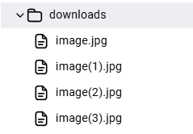
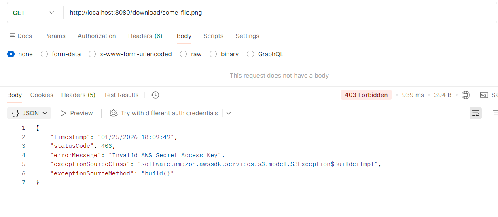
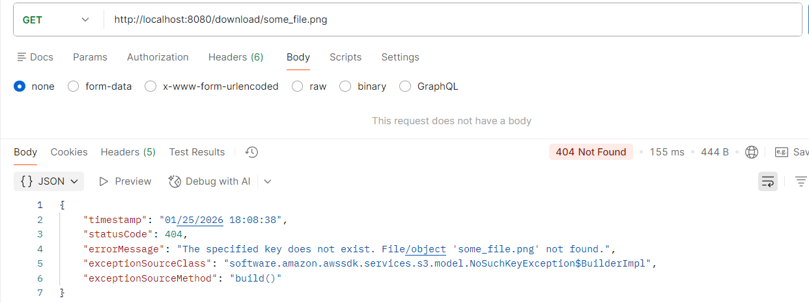

<!-- title -->
<h1 align="center">
    <span>Upload e Download de arquivos AWS</span>
</h1>

<br>

<!-- badges -->
<div align="left">
    </img>
    </img>
    </img>
</div>

<br>

<!-- About -->
##  Sobre o Projeto

Este sistema foi desenvolvido para fazer o upload e download de arquivos integrando os principais serviços da AWS. O objetivo foi aplicar na prática uma arquitetura de nuvem real, garantindo a comunicação entre EC2, S3 e RDS.


### Como funciona o fluxo:

1. Entrada (EC2): O arquivo é recebido via endpoint em uma aplicação hospedada na EC2

2. Storage (S3): O arquivo é enviado e armazenado em um Bucket S3.

3. Persistência (RDS): Os metadados do arquivo (nome, nome do bucket, data de envio) são registrados em um banco de dados RDS.

<br>

💡 Todas as informações sensíveis, credenciais AWS e dados de conexão com o banco foram preservadas e não estão expostas no repositório, utilizando variáveis de ambiente para proteção do sistema.

<hr>
<br>

##  Gestão de Arquivos Duplicados

Os arquivos baixados são armazenados no diretório `/app/downloads do container`. Para evitar a perda de dados, o sistema não sobrescreve arquivos existentes: caso você baixe um arquivo com nome idêntico a um já salvo, o sistema o renomeia automaticamente, garantindo que todas as versões sejam mantidas em segurança.



<hr>
<br>

<!-- Custom Exception Handler -->
##  Exceptions customizadas

Todas as exceções foram personalizadas para um melhor entendimento do usuário

<br>

**Exemplo 1**


	
<br>

**Exemplo 2**



<hr>
<br>

<!-- Technologies -->
##  Tecnologias e Dependências 

- Java 17
- Spring Boot 3.4.2 (Web, DevTools, Data JPA)
- Serviços AWS (EC2, S3, RDS) 
- Docker
- PostgreSQL
- Lombok


<hr>
<br>

##  Endpoints


| Método Http | URI | Descrição | Status Code esperado |                  
| :---:       | :--- |  :---    | :---:                |
| POST   | `http://enderecoEC2:8080/upload`     |         Envio de arquivo para o Bucket S3 + Registro de metadados no RDS      | 200 |
| GET     | `http://enderecoEC2:8080/download/{arquivo_tal}`      |         Busca no S3 e salva na instancia EC2          |  200 |

<hr>
<br>

<!-- Build and run -->
##  Rodando

Considerando que todo o ambiente AWS (VPC, Subnets, Route Tables e Security Groups) já está devidamente configurado:

<br>

1. Gerar o artefato (.jar) local

     ```bash
     git clone https://github.com/lGabrielDev/upload_download_arquivos_S3
     cd upload_download_arquivos_S3
     mvn clean package -Dmaven.test.skip
     ````

<br>

2. Transfira o arquivo .jar local pra a instancia EC2

     ```bash
     # Conseguimos acessar a instancia atraves da SSH key
     scp -i ~/sua-chave.pem target/download_upload_S3.jar ubuntu@endereco_IP_EC2:/home/ubuntu
     ```

<br>

3. Prepare a instancia EC2 para executar o .jar

     ```bash
     #acessando a instância
     ssh -i "AWS_SSH_key" ubuntu@endereco_IP_EC2 

     #dentro da instancia
     sudo apt-get update
     sudo apt-get install openjdk-17-jdk -y

     # Exportando variáveis de ambiente do banco
     export ENV_VAR_DATABASE_URL=jdbc:postgresql://seu-endpoint-rds:5432/nome_do_banco
     export ENV_VAR_DATABASE_USERNAME=seu_usuario
     export ENV_VAR_DATABASE_PASSWORD=sua_senha

     # Executando a aplicação com o profile específico
     java -jar download_upload_S3.jar --spring.profiles.active=devaws
     ```

     ⚠️ Para que a integração funcione, a instância EC2 deve possuir uma IAM Role com permissão de acesso ao S3.

<br>


<!-- Credits -->
<h2>
    
    <span>Créditos</span>
</h2>

<p>As imagens usadas nesse projeto foram retiradas dos seguintes sites:</p>

- [shields.io](https://shields.io/)
- [iconfinder](https://www.iconfinder.com/)
- [storyset](https://storyset.com/)
- [vecteezy](https://www.vecteezy.com)
- [imgix](https://www.imgix.com/)

     <span>Thanks!</span>

<hr>
<br>


<!-- License -->
##  Licença --> MIT

O projeto está sob a licença do [MIT](./LICENSE.txt).

<hr>
<br>

