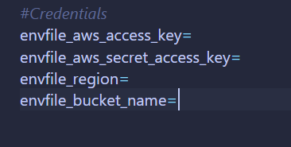

<!-- title -->
<h1 align="center">
    <span>Sistema de Pedidos</span>
</h1>

<br>

<!-- badges -->
<div align="left">
    </img>
    </img>
    </img>
</div>

<br>

<!-- About -->
##  Sobre o Projeto

Este sistema foi criado para enviar (upload) e baixar (download) arquivos no serviço Amazon S3 (AWS)


O que o sistema faz:

- Upload: Salva seus arquivos com segurança na nuvem da Amazon.

- Download: Busca o arquivo na nuvem e o salva automaticamente em uma pasta dentro do container

- Tratamento de Exceções: O sistema identifica e avisa se algo estiver errado.


<hr>
<br>

##  Gestão de Arquivos Duplicados

Os arquivos baixados são armazenados no diretório `/app/downloads do container`. Para evitar a perda de dados, o sistema não sobrescreve arquivos existentes: caso você baixe um arquivo com nome idêntico a um já salvo, o sistema o renomeia automaticamente, garantindo que todas as versões sejam mantidas em segurança.


<hr>
<br>

<!-- Custom Exception Handler -->
##  Exceptions customizadas

Todas as exceções foram personalizadas para um melhor entendimento do usuário

<br>

**Exemplo 1**


	
<br>

**Exemplo 2**


<hr>
<br>

<!-- Technologies -->
##  Tecnologias

- Java 17
- Spring Boot 4.0.2
- Spring Web
- Spring Boot DevTools
- lombok
- Docker 27.0.3
- Amazon S3 (AWS SDK)


<hr>
<br>

##  Endpoints


| Método Http | URI | Descrição | Status Code esperado |                  
| :---:       | :--- |  :---    | :---:                |
| POST   | `http://localhost:8080/upload`     |         Envio de arquivo para o Bucket S3      | 200 |
| GET     | `http://localhost:8080/download/{arquivo_tal}`      |         Busca no S3 e salva na pasta do container            |  200 |

<hr>
<br>

<!-- Build and run -->
##  Rodando a aplicação

### Requisitos
- [git](https://git-scm.com/downloads)
- [Docker](https://docs.docker.com/desktop/wsl/)

<br>

### Passo a passo

1. Clone esse repositório
    ```bash
    git clone https://github.com/lGabrielDev/upload_download_arquivos_S3
    ```
<br>

2. Vá ao diretorio

     ```bash
     cd upload_download_arquivos_S3
     ```

<br>

3. Configure as credenciais da AWS no seu arquivo .env

    

<br>

4. Suba o container

     ```bash
     docker compose up --build;
     ```

<br>

5. O serviço estará disponível em: `http://localhost:8080`

<hr>
<br>

<!-- Credits -->
<h2>
    
    <span>Créditos</span>
</h2>

<p>As imagens usadas nesse projeto foram retiradas dos seguintes sites:</p>

- [shields.io](https://shields.io/)
- [iconfinder](https://www.iconfinder.com/)
- [storyset](https://storyset.com/)
- [vecteezy](https://www.vecteezy.com)
- [imgix](https://www.imgix.com/)

     <br>

     <span>Thanks!</span>

<hr>
<br>


<!-- License -->
##  Licença --> MIT

O projeto está sob a licença do [MIT](./LICENSE.txt).

<hr>
<br>

